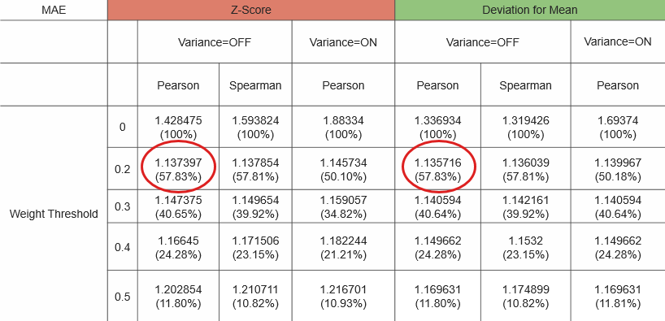

# Project 4: Collaborative Filtering

### [Project Description](doc/project4_desc.md)

Term: Spring 2018

+ Team #10
+ Projec title: Collaborative Filtering
+ Team members
	+ Dong, Jiaqi
	+ Ji, Hanying
	+ Liu, Mingming
	+ Zhang, Yiyi
+ Project summary: 
In this project, we implemented several collaborative filtering algorithm based on two datasets:
[1]Microsoft Website(implicit): user database with 4151 users and 269 websites, recording whether a user visited a website or not by binary 0-1;
[2]Each Movie(explicit): user database with 5055 users and 1619 movies, recording uses's votes if exist, which range from 1 to 6.
Goal: Evaulating the result of recommendation by [1]Model-Based Algorithm (Cluster Model) and [2]Memory-Based Algorithm, combined with several methods in calculating similarity weights, selecting neighbors by setting threshold, rating normalization to get the expected utility of the ranked list for implicit and MAE for explicit data.
Conclusion: For data1, the Simrank correlation is better than other correlation. For data2, the Memory-Based Model (pearson, threshold=0.2) is better than the Cluster Model. The Variance Weighting improve the performance for data1, while lower the performance for data2. The best threshold is 0.2 for both data sets.

[**`main.Rmd`**](doc/main.Rmd)/[**`main.nb.html`**](doc/main.nb.html): project report 


[**`ads_project4_group10.pptx`**](doc/ads_project4_group10.pptx): presentation slides   





**Contribution statement**:  
+ Ji, Hanying: Mainly took responsibility of Memory-Based Algorithm with Liu, MingMing. Focused on implicit Microsoft website dataset and wrote funtions for [1]reshaping data(transfer_1,transfer_1_test);[2]calculating similarity weight of pearson and spearman correlation(simweight);[3]selecting neighbors by weighting threshold and calculate coverage(get_neighbors_index);[4]predicting scores by scaling/no scaling(pred_1);[5]evaluating different combinations of methods by ranked list score(ranked_score). Collaborated with Zhang, Yiyi in writing the main.Rmd file.

+ Liu, Mingming: Presenter in this project. Mainly responsible for Memory-Based Algorithm with Ji, Hanying. Foucused on explicit Movie dataset and wrote functions for \n[1] reshaping data2; [2] calculating pearson correlation, spearman correlation, simrank and vaiance weighting correlation; [3] replacing NA with numbers in each correlation; [4] writing prediction function for dataset2 by scaling/ no scaling; [5] evaluating different combinations of methods by MAE score; [6] designing ppt. 

+ Yiyi, Zhang: Built and implemented the Cluster Model to Data Set 2. Constructed the notebook structure and wrote ToC, Step 0-1, and the cluster model part in the main.Rmd file. Downloaded the datasets and reference papers, and organized the repository including the READMEs. 

+ Jiaqi, Dong: [1] Write up the Evaluation functions. [2] Write up the table_function. [3] Construct the evaluation part in the main.Rmd file. [4] Do the prediction and evaluate the MAE score of spearman method.

 PS: Some similiarity weighting matrix is too large and can't be upload to github so we upload it to google drive. The link is:
 https://drive.google.com/drive/folders/1iWA7Y9CbPxi3Ryml_B-eXpTQsQ7G1RYx?usp=sharing
 
 Following [suggestions](http://nicercode.github.io/blog/2013-04-05-projects/) by [RICH FITZJOHN](http://nicercode.github.io/about/#Team) (@richfitz). This folder is orgarnized as follows.

```
proj/
├── lib/
├── data/
├── doc/
├── figs/
└── output/
```

Please see each subfolder for a README file.
